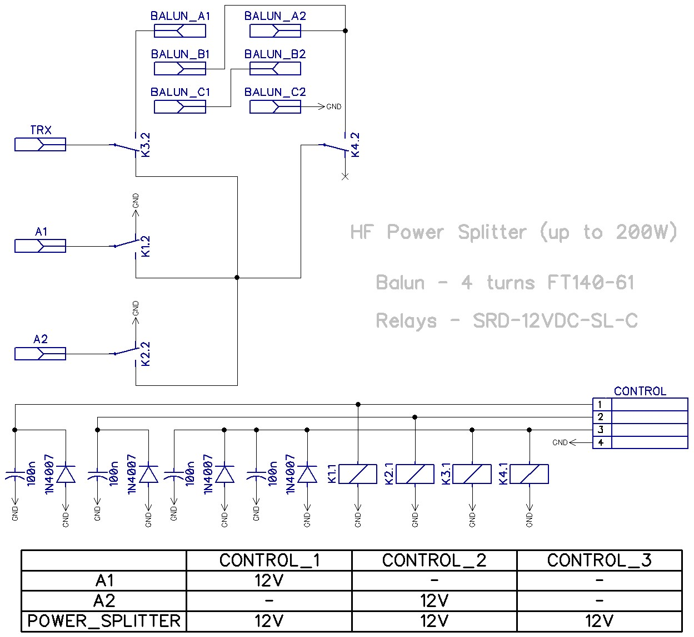
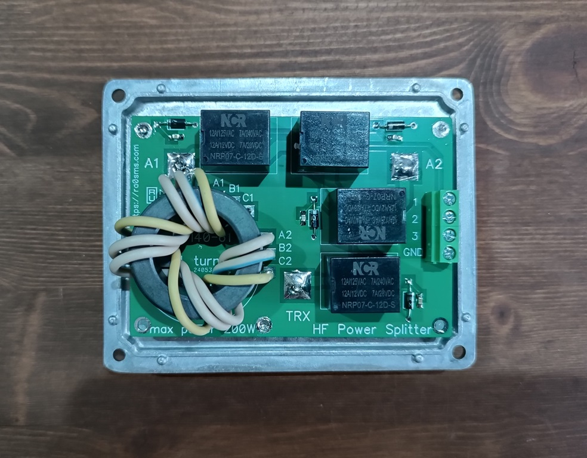
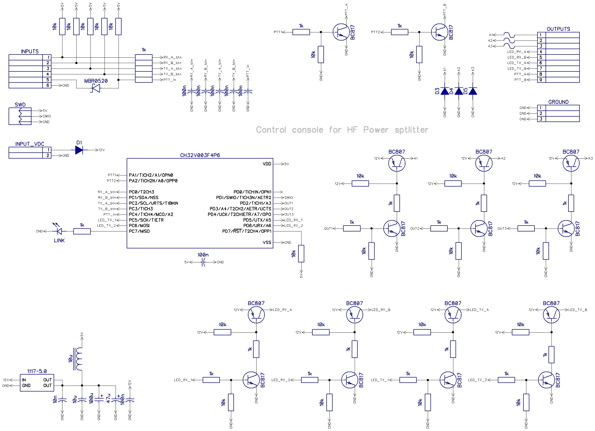
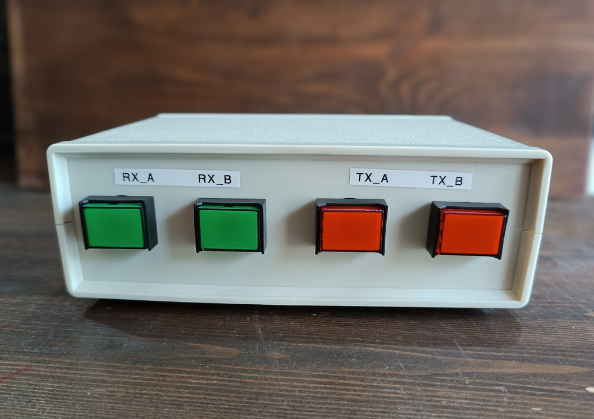
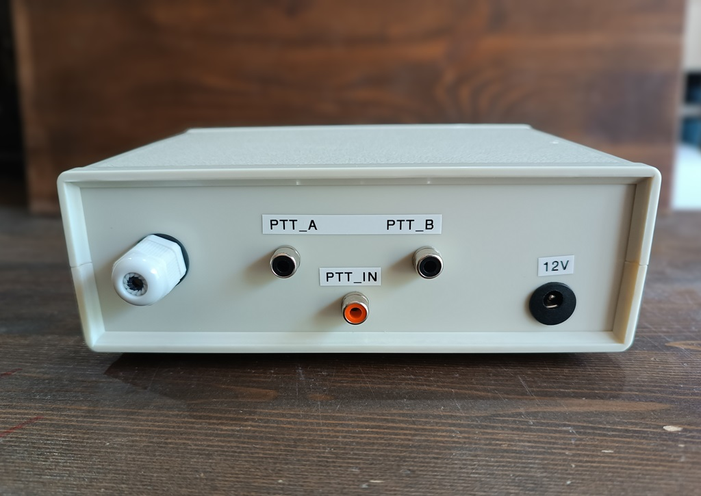

# HF Power Splitter and its control console

HF power splitter uses for splitting RF power from one source to two loads. 

You can use two HF antennas or two power amplifiers for splitting your signal.

Based on FT140-61 Amidon core.

More information - https://ra0sms.com/hf-power-splitter/

-------------------------------------------------------

Power supply: 12-13.8V

Consumption current: 300mA

SWR: <1.5 (1-30MHz)

Control console based on RISK-V MCU CH32V003f4p6

